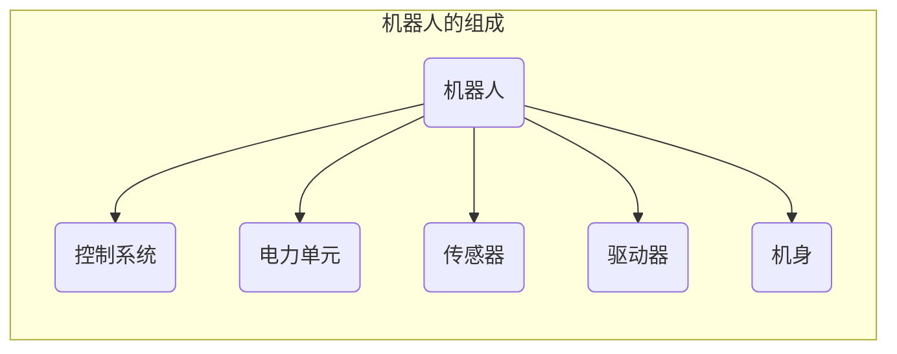
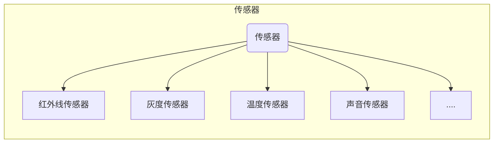
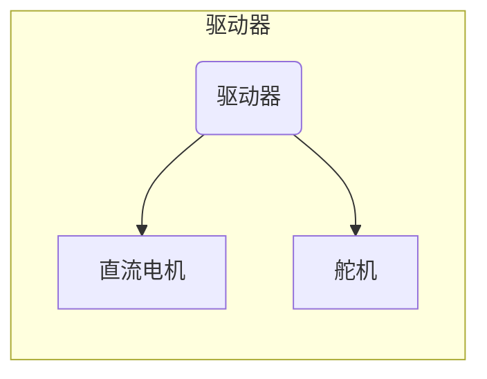

# 认识机器人

&emsp;&emsp;我们已经掌握了开源硬件的很多知识，传感器可以将外界的各种信息输入到主控板中，而这些信息（数字信号/模拟信号）在计算机中都是以数据的形式存在的。**通过编程的方式可以赋予机器一定的功能，为我们服务**。这其实是我们在赋予机器智能，那么让我们走进机器人的世界，利用开源硬件开发功能各异的机器人吧！

## 一、什么机器人

&emsp;&emsp;**提起机器人，你会想到什么**？很多影视作品中就有机器人形象，就像这样。。。。。。**这些机器人怎么样，找几个形容词来描述一下**。智能、高科技、酷......当然这些机器人有科幻加工的成分。科幻某种程度上是基于当今科技水平对未来的想象和预测，其实我们正在逐步进入一个“人工智能”的时代。

&emsp;&emsp;**你在生活中有没有见过机器人呢**？没错，扫地机器人、擦窗机器人、机器人店长、小美烹饪机器人......我们现实生活中各式各样的机器人越来越多。
那么，到底什么是机器人呢？下面是有关机器人的定义。
>机器人（Robot）是一种具有高度灵活性的自动化机器，具备一些与人或者其他生物相似的能力，如感知能力、动作能力、规划能力等。

&emsp;&emsp;**如何判断一个机器是否是机器人呢**？我们可以从机器人的三大基本特征着手。

- **大脑**：自动控制的程序。
- **身体**：一定的结构形态。
- **能力**：完成一定动作的能力。

## 二、机器人的发展

&emsp;&emsp;人们对机器人的幻想和追求已有几千年的历史。人类与动物的主要区别就在与人类的智力，而创作和使用工具正是人类智能的体现，如果智能机器人能够听从人类指挥从事一切劳动，可以说它是人类不断发明、改进工具的终极目标。其实，机器人的英文Robot一词就来自1920年捷克作家卡雷尔·卡偑克发表的科幻戏剧《罗萨姆的万能机器人》的名称中的robotnik（奴隶）。

### 古代机器人

- 木牛流马
  - 三国时期，诸葛亮发明“木牛流马”，可以运送军用物资，可称为最早的陆地军用机器人。
- 古希腊自动机
  - 公元前2世纪，亚历山大时代的古希腊人发明了最原始的机器人—自动机。它是以水、空气和蒸汽压力为动力的会动的雕像，它可以自己开门，还可以借助蒸汽唱歌。
  
### 现代机器人

&emsp;&emsp;20世纪中期，随着计算机和自动化技术的发展，机器人迅速得到了普及。

- 第一代机器人
  - 这些机器人是遥控操作的机器，工作方式是人通过**遥控**设备对机器进行指挥，而机器人本身并不能独立控制运动。
- 第二代机器人
  - 依旧是通过**程序**被控制，可以**自动重复完成某种方式的操作**
- 第三代机器人：智能机器人
  - 利用传感器提高机器人的可操作性，具备感知能力。能够自主进行**记忆、推理、决策**。

## 三、机器人的分类

&emsp;&emsp;根据机器人的使用范围，可以将机器人分为：工业、民用、军用和特种。

### 工业机器人

工业机器人是一种面向工业生产的、能够自主执行工作、多轴联动的机械设备。它们通常配有机械手或其他可装配的加工工具，能够执行搬运操作与加工任务。

### 民用机器人

民用机器人以人为服务对象，可以部分地或全自动地帮助人们完成服务工作。例如，维护、监控、搬运、娱乐、保洁、保安、救助等。

**学生机器人**属于民用机器人。

### 军用机器人

军用机器人是用于军事活动的机器装置。例如，机器人士兵、反坦克机器人、无人潜水器等。

### 特种机器人

特种机器人是指用于**非制造业**的各种**先进**机器人，包括水下机器人、娱乐机器人、农业机器人、医疗机器人、机器警察等。

## 四、机器人的组成

机器人不仅有“器官”，还能用它们来处理问题。其实机器人处理信息的过程和人类相似。
问：机器人如何感知现实生活中的信息？举例。

### 控制系统

控制系统是机器人的大脑。

### 电力单元

电力单元是机器人的能量来源。

### 传感器

### 驱动器

### 机身

学生机器人的机身可以常用`乐高科技系列`的积木来搭建。

> 机器人有三大基本特征：
>
> - 大脑：自动控制的程序。
> - 身体：一定的结构。
> - 能力：完成一定动作的能力。
