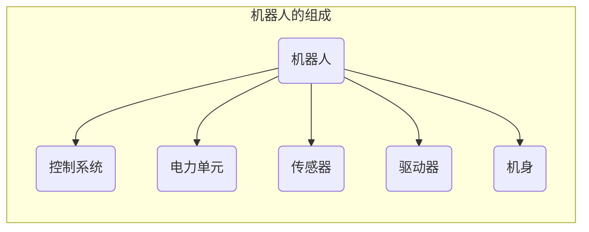
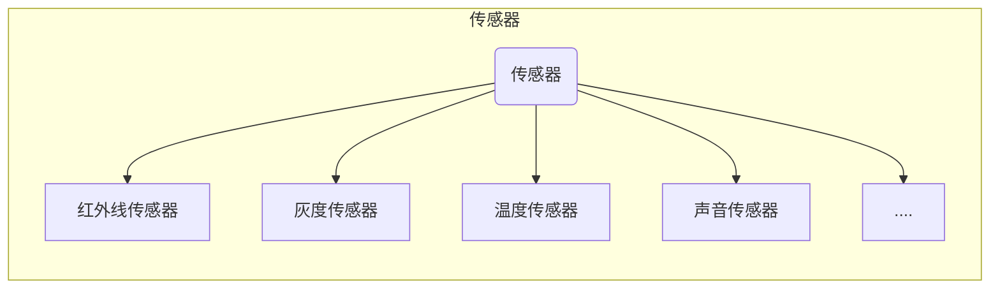
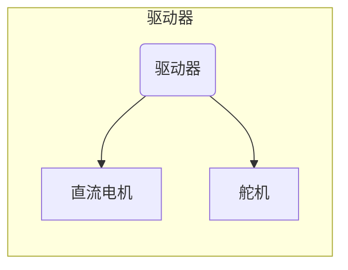

# 认识机器人

&emsp;&emsp;我们已经掌握了开源硬件的很多知识，传感器可以将外界的各种信息输入到主控板中，而这些信息（数字信号/模拟信号）在计算机中都是以数据的形式存在的。通过编程的方式可以赋予机器一定的功能，为我们服务。这其实是我们在赋予机器智能，那么让我们走进机器人的世界，利用开源硬件开发功能各异的机器人吧！

## 一、什么机器人

>机器人（Robot）是一种具有高度灵活性的自动化机器，具备一些与人或者其他生物相似的能力，如感知能力、动作能力、规划能力等。

问：你在生活中有没有见过机器人呢？

## 二、机器人的发展

人们对机器人的幻想和追求已有几千年的历史。

## 三、机器人的分类

根据机器人的使用范围，可以将机器人分为：工业、民用、军用和特种。

### 工业机器人

### 民用机器人

**学生机器人**属于民用机器人。

### 军用机器人

### 特种机器人

## 四、机器人的组成

机器人不仅有“器官”，还能用它们来处理问题。其实机器人处理信息的过程和人类相似。
问：机器人如何感知现实生活中的信息？举例。

### 控制系统

控制系统是机器人的大脑。

### 电力单元

电力单元是机器人的能量来源。

### 传感器

### 驱动器

### 机身

学生机器人的机身可以常用`乐高科技系列`的积木来搭建。

> 机器人有三大基本特征：
>
> - 大脑：自动控制的程序。
> - 身体：一定的结构。
> - 能力：完成一定动作的能力。
