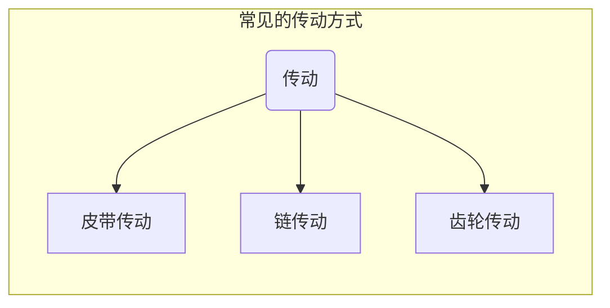

# 机器人传动

&emsp;&emsp;上一节我们已经知道一个完整的机器人由`控制系统`、`电力单元`、`传感器`、`驱动器`、`机身`五大部分组成。本节我们来关注`驱动器`的动作输出。

&emsp;&emsp;学生机器人中驱动器的核心一般是`直流电机`、`伺服电机`，这些电机能将电能转化为动力输出，但光有电机是不够的，复杂的机器人动作往往还需要配合`机械结构`将电机提供的动力合理的传动出去，让机器人更好的运动起来。

&emsp;&emsp;`皮带传动`、`链传动`、`齿轮传动`是传动系统常用的传递动力的方式。下面我们就来认识这三种传动系统。

## 皮带传动
>皮带传动是通过皮带将动力从主动轮传递到从动轮上的一种传动方式。

在工业生产、日常生活中，皮带传动很常见。如：鼓风机皮带传动、摩托车中皮带传动。

皮带和滑轮经过巧妙的组合，可以改变传动的方向和功率。皮带传动有很多种经典的组成模型，如：

## 链传动
>链传动是通过链条将动力从主动轮传递到从动轮上的一种传动方式。

## 齿轮传动
>齿轮传动是通过相互啮合齿轮将动力从主动轮传递到从动轮上的一种传动方式。